# LaTeX Code Generator

A web application for visually building computer science and mathematics structures and generating publication-ready LaTeX code. Built as a diploma thesis project at the Technical University of Kosice (TUKE), Faculty of Electrical Engineering and Informatics.

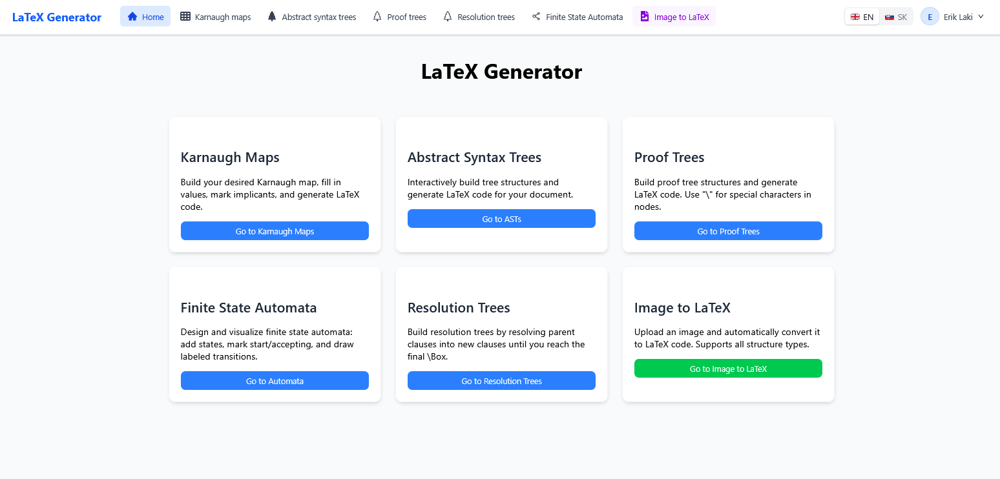

## Features

### Visual Builders

Each builder provides an interactive editor where you construct your structure visually, then export the corresponding LaTeX code with a single click.

**Karnaugh Maps** -- Build K-maps with support for implicants (classic, edge, corner), custom variable names, and Gray code ordering. Generates code using the `karnaugh-map` LaTeX package.

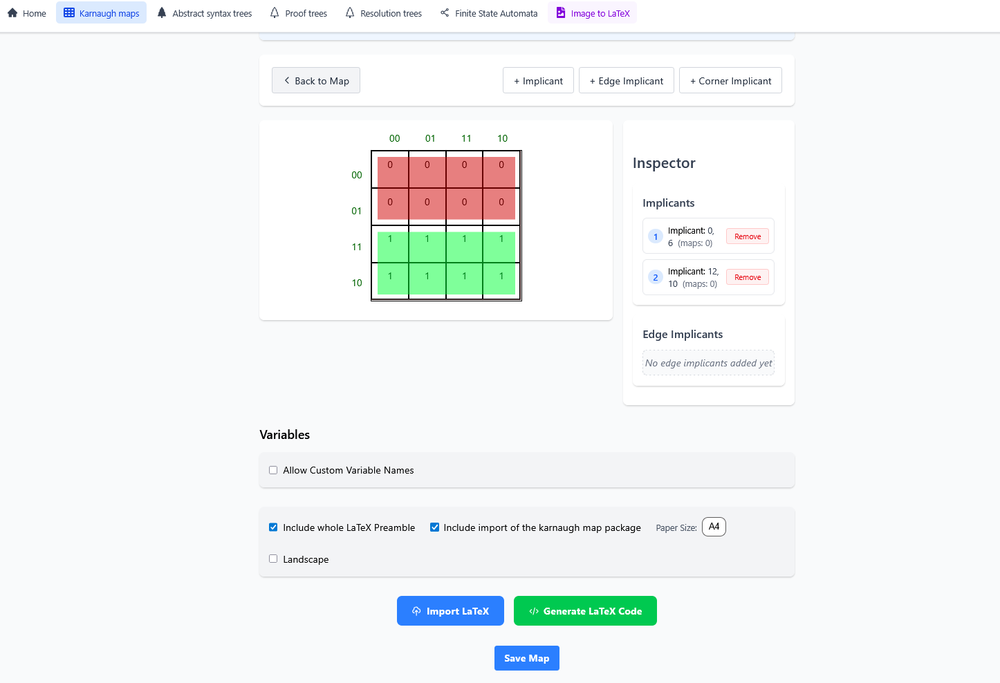

**Abstract Syntax Trees** -- D3-based tree editor with node and edge styling (shapes, colors, dashed/dotted lines, arrows), multiple layout orientations, and code generation using the `forest` LaTeX package.

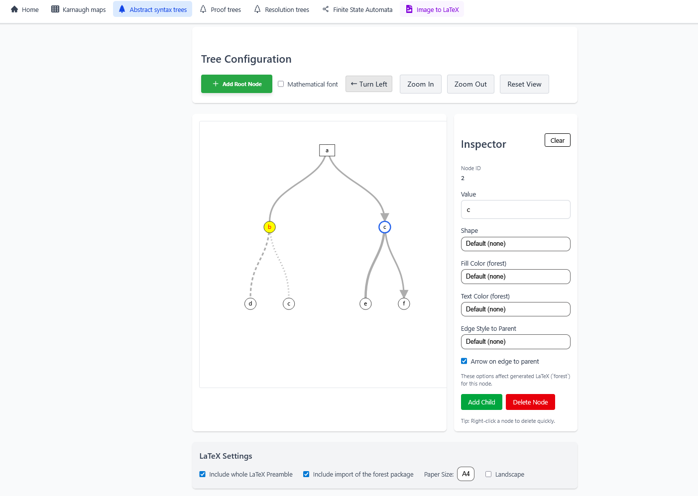

**Proof Trees** -- Construct proof trees with math mode support (global and per-node), right labels, and export using the `bussproofs` LaTeX package.

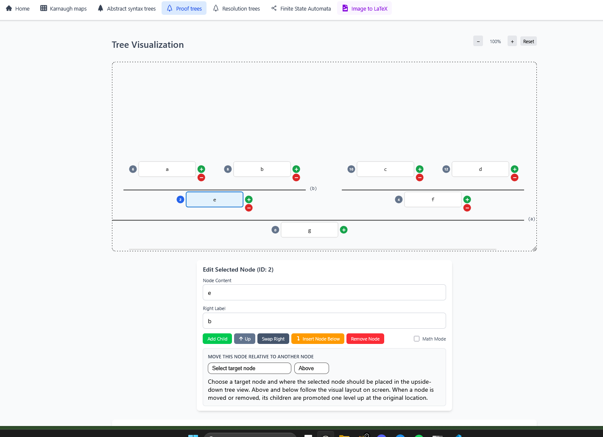

**Resolution Trees** -- Build resolution proof trees with clause resolution, extra links, math mode labels, and code generation using `tikz-qtree`.

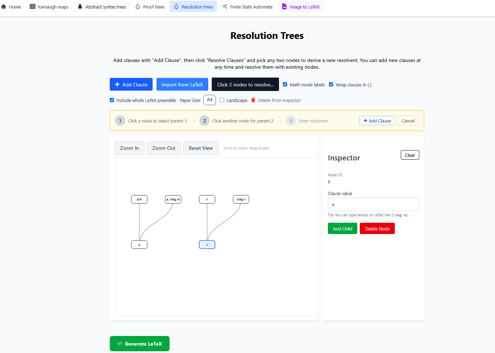

**Finite State Automata** -- Drag-and-drop automata designer with transitions (including self-loops), start/accepting state marking, auto-layout, and TikZ code generation.

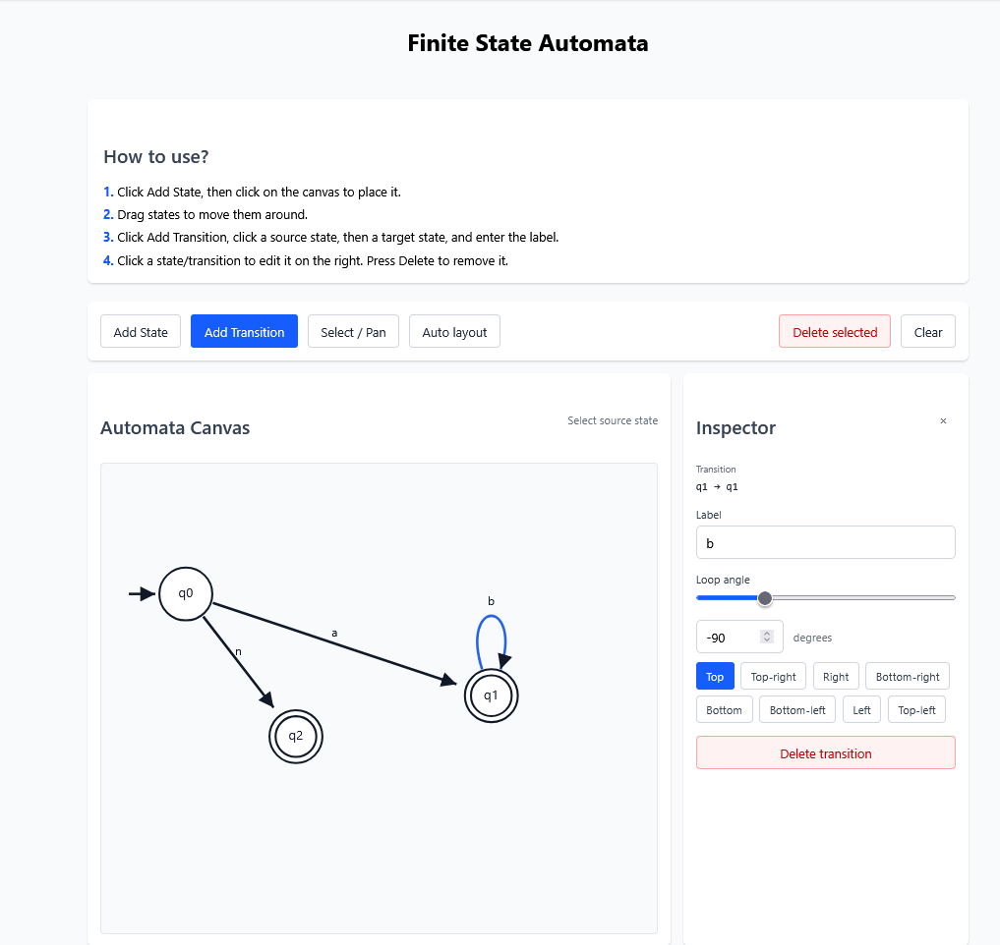

### Image to LaTeX (AI-Powered)

Upload a hand-drawn image of any supported structure and use AI to automatically convert it to LaTeX code. Supports OpenAI GPT and OpenRouter (300+ models). Images are preprocessed via OpenCV (adaptive thresholding, cropping) before being sent to the model.

| Upload | Result |
|--------|--------|
| 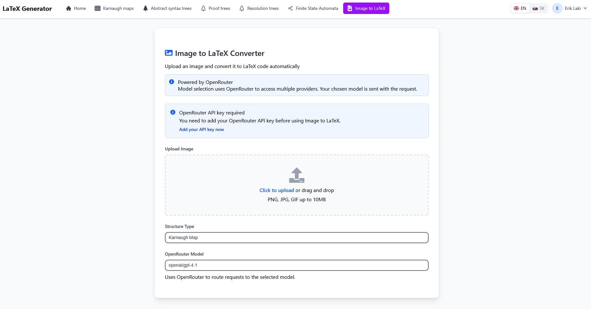 | 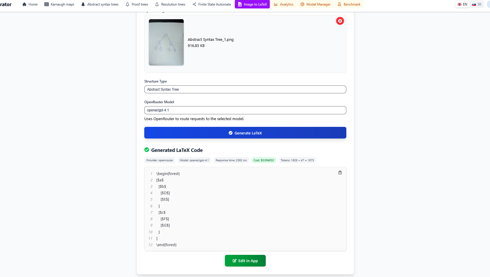 |

### LaTeX Editor & Compiler

Integrated Monaco-based code editor with live PDF compilation, PDF preview, SVG export, and `.tex` file download.

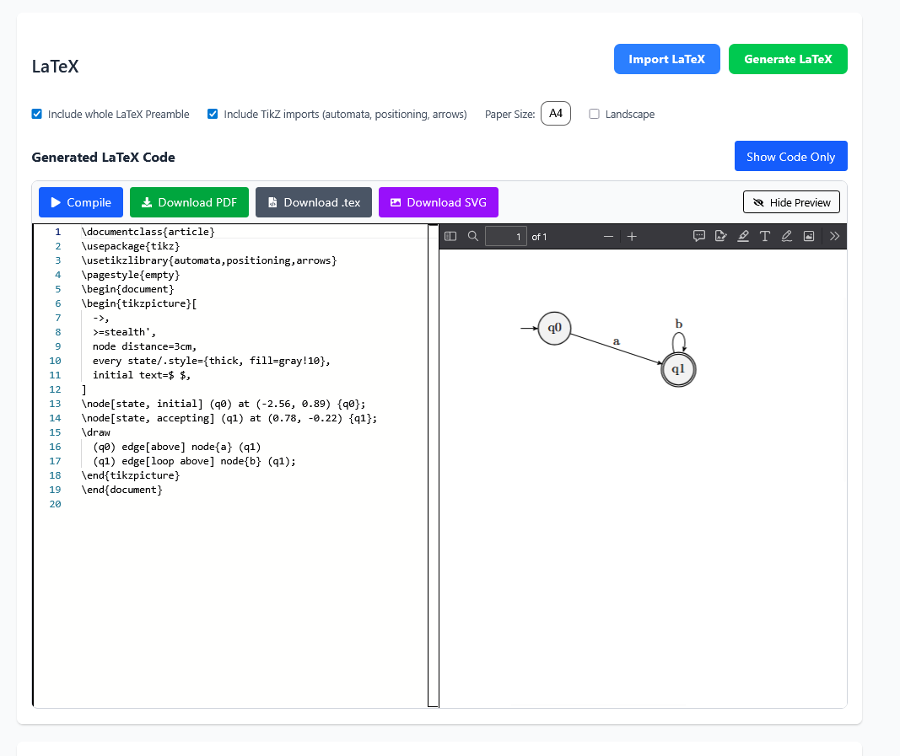

### LaTeX Import

Import existing LaTeX code back into any visual editor for modification.

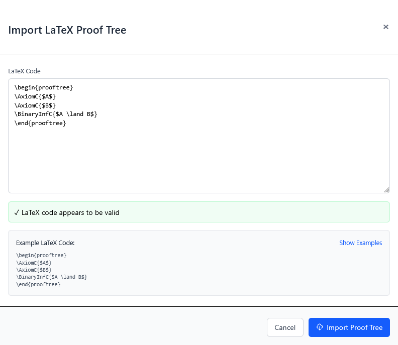

### Authentication

Multiple authentication methods: email/password registration, TUKE SSO (Keycloak/OpenID Connect), Google OAuth, and GitHub OAuth.

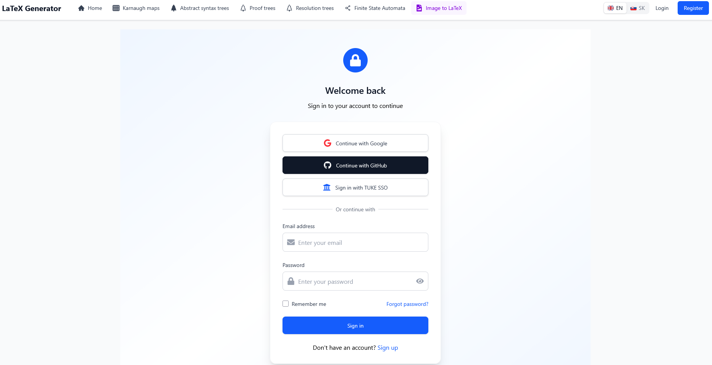

### User Profile & BYOK

Authenticated users can save, load, edit, and delete their structures. Users can also add their own OpenRouter API key (encrypted at rest with AES-256-GCM) for the Image-to-LaTeX feature.


### Admin Panel

Model management (add/enable/disable OpenRouter models), model benchmarking, BYOK toggle, and analytics dashboard (Umami integration).

| Model Manager | Benchmarks |
|---------------|------------|
| 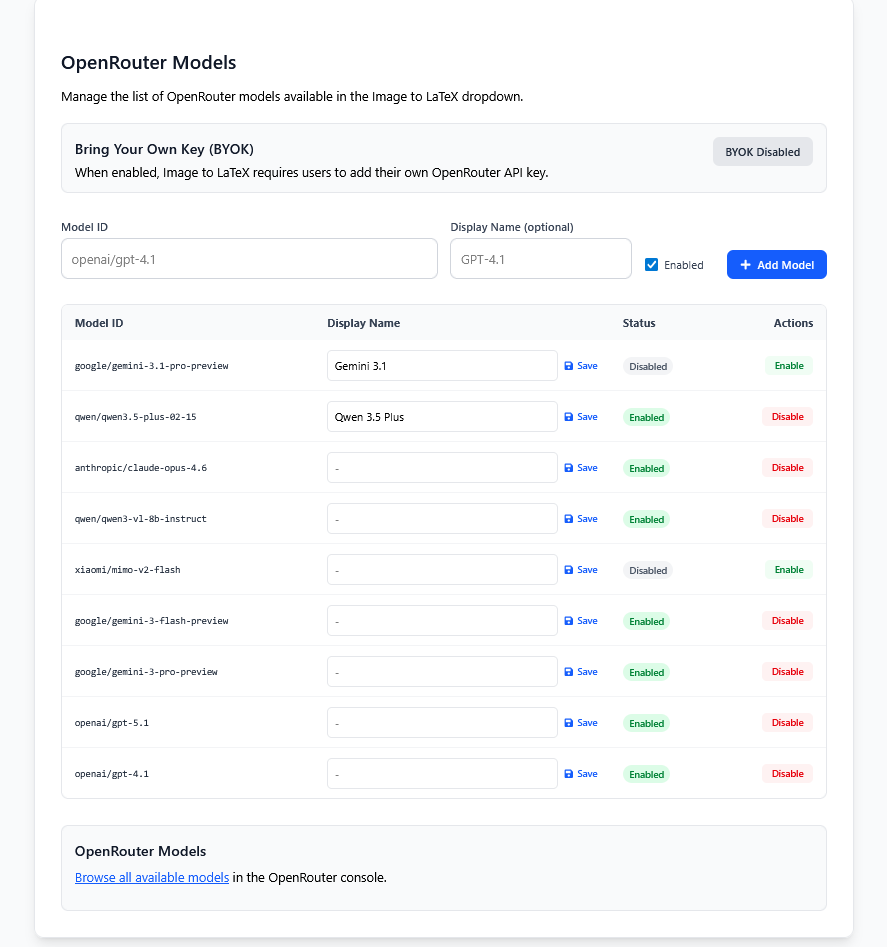 | 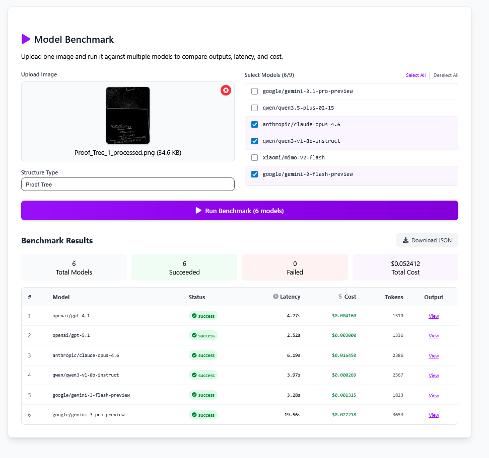 |

### Internationalization

Full English and Slovak language support via i18next.

## Architecture

The application is composed of multiple services orchestrated with Docker Compose:

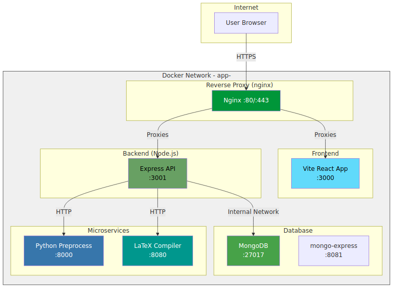

| Service | Technology | Purpose |
|---------|-----------|---------|
| **Frontend** | React 19, Vite, Tailwind CSS, D3.js, Monaco Editor | Interactive UI and visual editors |
| **Backend** | Node.js, Express, TypeScript, Mongoose | REST API, authentication, AI integration |
| **MongoDB** | MongoDB | Data persistence |
| **Python Preprocess** | FastAPI, OpenCV | Image preprocessing for AI feature |
| **LaTeX Compiler** | FastAPI, TeX Live | LaTeX compilation to PDF/SVG |
| **Reverse Proxy** | nginx | Routing, TLS termination |

## Prerequisites

- Docker and Docker Compose v2
- Node.js 20+ and npm (for local development)

## Getting Started

### 1. Clone the repository

```bash
git clone <repository-url>
cd latex-code-generator
```

### 2. Configure environment variables

Create a `.env` file in the project root:

```env
# MongoDB
MONGO_ROOT_USERNAME=admin
MONGO_ROOT_PASSWORD=<your-password>

# JWT
JWT_SECRET=<your-secret>

# AI Provider ("openai" or "openrouter")
AI_PROVIDER=openrouter
OPENAI_API_KEY=<your-key>          # if using openai
OPENROUTER_API_KEY=<your-key>      # if using openrouter

# BYOK encryption (256-bit key)
BYOK_ENCRYPTION_KEY=<your-encryption-key>

# SSO (TUKE Keycloak) - optional
SSO_ISSUER=<issuer-url>
SSO_CLIENT_ID=<client-id>
SSO_CLIENT_SECRET=<client-secret>
SSO_REDIRECT_URI=<redirect-uri>
SSO_SCOPES=openid profile email

# Google OAuth - optional
GOOGLE_ISSUER=https://accounts.google.com
GOOGLE_CLIENT_ID=<client-id>
GOOGLE_CLIENT_SECRET=<client-secret>
GOOGLE_REDIRECT_URI=<redirect-uri>
GOOGLE_SCOPES=openid profile email

# GitHub OAuth - optional
GITHUB_CLIENT_ID=<client-id>
GITHUB_CLIENT_SECRET=<client-secret>
GITHUB_REDIRECT_URI=<redirect-uri>

# Frontend URL (for SSO redirects)
FRONTEND_URL=http://localhost:5173

# Mongo Express
ME_USERNAME=admin
ME_PASSWORD=<your-password>

# Domain (for reverse proxy)
DOMAIN=localhost
```

### 3. Run with Docker Compose

```bash
docker compose build
docker compose up -d
```

The application will be available at `http://localhost`.

### Local Development

For development without Docker (frontend and backend only):

```bash
# Install dependencies
cd backend && npm install
cd ../new-frontend && npm install
cd ..

# Start both services concurrently
npm run dev
```

Or use the included tmux launcher:

```bash
./start-app.sh
```

| Service | URL |
|---------|-----|
| Frontend (Vite dev) | http://localhost:5173 |
| Backend API | http://localhost:3001 |
| Mongo Express | http://localhost:8081 |

> **Note:** The Python microservices (preprocess and LaTeX compiler) still need to run via Docker even in local dev mode. You can start just those services with:
> ```bash
> docker compose up -d python-preprocess latex-compiler latex_db_instance
> ```

## Project Structure

```
latex-code-generator/
├── backend/                # Node.js + TypeScript API server
│   ├── src/
│   │   ├── controllers/    # Route handlers
│   │   ├── models/         # Mongoose schemas
│   │   ├── routes/         # Express route definitions
│   │   ├── services/       # Business logic (AI, LaTeX, SSO)
│   │   ├── middleware/     # Auth, admin, file upload
│   │   └── utils/          # Encryption utilities
│   └── Dockerfile
├── new-frontend/           # React SPA (Vite)
│   ├── src/
│   │   ├── Pages/          # Page components per feature
│   │   ├── Components/     # Reusable UI components
│   │   ├── context/        # Auth context
│   │   ├── services/       # API service modules
│   │   └── locales/        # i18n translations (en, sk)
│   └── Dockerfile
├── python-preprocess/      # FastAPI + OpenCV image preprocessing
├── latex-compiler/         # FastAPI + TeX Live compilation service
├── infra/                  # nginx reverse proxy configs
├── docker-compose.yml      # Full-stack orchestration
├── deploy.sh               # Deployment automation script
└── start-app.sh            # Local dev tmux launcher
```

## Deployment

The `deploy.sh` script automates deployment on a remote server:

```bash
# Deploy all services (pulls latest code, rebuilds, restarts)
./deploy.sh

# Skip git pull
./deploy.sh --no-pull

# Deploy specific services only
./deploy.sh backend frontend
```

## Tech Stack

**Frontend:** React 19, Vite 7, Tailwind CSS, D3.js, Monaco Editor, React Router, Formik, i18next, Axios, react-pdf

**Backend:** Node.js 20, Express, TypeScript, Mongoose, OpenAI SDK, OpenRouter SDK, JWT, bcryptjs, openid-client, Multer, Helmet

**Microservices:** FastAPI, OpenCV, TeX Live, pdflatex, dvisvgm

**Infrastructure:** Docker, Docker Compose, nginx, MongoDB, Umami (analytics)

## License

This project was developed as a diploma thesis at the Technical University of Kosice (TUKE), Faculty of Electrical Engineering and Informatics, Department of Computers and Informatics.
